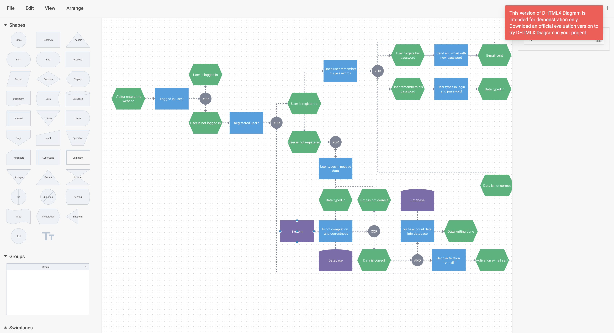

# DHTMLX Diagram with React Demo

[](https://dhtmlx.com/)

[How to start](#how-to-start) | [Key features](#key-features) | [License](#license) | [Useful links](#links) | [Other examples](#examples) | [Join our online community](#join)



The DHTMLX [JavaScript Diagram library](https://dhtmlx.com/docs/products/dhtmlxDiagram/) allows developers to create interactive, customizable diagrams such as flowcharts, organizational charts, network diagrams, mind maps, etc. It simplifies complex data visualization by organizing it into a clear hierarchical structure using automatic layouts and live editors.

<a name="how-to-start"></a>
## How to start

Clone the repository or download files.

```
yarn
yarn start
```

or

```
npm install
npm run start
```

You can also use [GitHub Codespaces](https://docs.github.com/en/codespaces/developing-in-a-codespace/creating-a-codespace-for-a-repository) to run online.

<a name="key-features"></a>
## DHTMLX Diagram key features

- Live Diagram, Org chart, and Mindmap editors for a quick diagram arrangement
- Orthogonal and Radial auto layout modes
- Adding partner and assistant shapes
- Searching and filtering
 
[](https://snippet.dhtmlx.com/846cz71r?tag=diagram_editor&mode=wide)

- Creating swimlanes and groups
- Expanding and collapsing branches
- Creating custom shapes

[](https://snippet.dhtmlx.com/plqsq611?tag=diagram_editor&mode=wide)

- Group work with multiple objects (select, copy, move, delete)
- Intuitive drag-n-drop behavior
- Snap lines
- Configurable Toolbar, Shapebar, and Editbar elements

[](https://snippet.dhtmlx.com/1qh2r0ub?tag=diagram_editor&mode=wide)

- Built-in themes
- Inline editing
- Touch support
- Keyboard navigation
- Cross-browser support
- Export to PDF and PNG

<a name="license"></a>
## License ##
This demo is available under the Evaluation license. To use it in your projects, please choose a proper license on the DHTMLX website: [https://dhtmlx.com/docs/products/licenses.shtml](https://dhtmlx.com/docs/products/licenses.shtml)

<a name="links"></a>
## Useful links

- [More demos about the DHTMLX Diagram functionality](https://snippet.dhtmlx.com/a9t2z2dt?tag=diagram&mode=wide)
- [Technical support ](https://forum.dhtmlx.com/c/diagram)
- [Online  documentation](https://docs.dhtmlx.com/diagram/)

<a name="examples"></a>
## Other examples

Check out examples of using DHTMLX Diagram with other technologies:

| JavaScript | Angular | Vue |
| ----- | ----- | ----- |
| [](https://dhtmlx.com/docs/products/dhtmlxDiagram/) | [](https://github.com/DHTMLX/angular-diagram-demo) | [](https://github.com/DHTMLX/vue-diagram-demo) |

<a name="join"></a>
## Join our online community

- Star our GitHub repo :star:
- Watch our tutorials on [YouTube](https://www.youtube.com/user/dhtmlx/videos) :tv:
- Read us on [Medium](https://dhtmlx.medium.com) :newspaper:
- Follow us on [X](https://x.com/dhtmlx) :bird:
- Check our news and updates on [Facebook](https://www.facebook.com/dhtmlx/) :feet:
